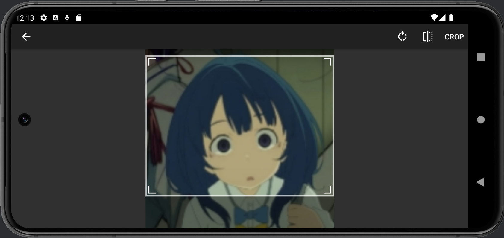
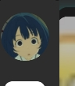

## It's MYGO!!!

### How to run
- Run server
```shell
    cd backend && docker compose up -d --build
```
- Remove images
```shell
    cd backend && docker compose down --rmi all
```

- Start each microservice separately; the web and mobile terminals are used for debugging.
    - web
    ```shell
        cd web && npm start
    ```
    - mobile
    ```shell
        cd mobile/App && npm start
    ```
    - user microservice
    ```shell
        cd backend/app/usercenter/api && go run usercenter.go
    ```
    - media microservice
    ```shell
        cd backend/app/media/api && go run media.go
    ```
    - audio analysis microservice
    ```shell
        cd backend/app/audioanalysis && source .venv/bin/activate && python3 consumer.py
    ```


### How to use

---
#### Web
##### Section 1: Welcome page
- New user should register an account. The password must include uppercase and lowercase letters, special characters, and be longer than 8 characters.


- Once you have an account you can login by enter email and password. If you forget the password, you can reset it.


##### Section 2: Sub-user management
- The web client can only be used by the account owner, usually parents. They can create multiple sub accounts.

- You can view each sub-user's basic information and music practice records

- You can edit sub user’s information.


##### Section 3: Historical performance details page
On the details page, we can view various data for each performance, such as the user's performance and the corresponding reference performance's video and audio, the generated visualized images, sheet music, and summary reports.
- View reference performance video.

- View user performance audio.

- View sheet music generated based on the reference performance video.

- View feedback report.

- Based on the feedback report, we can obtain the user's note accuracy, dynamic accuracy, and rhythm accuracy, as well as identify the notes where the user made errors during the performance.
  - For example, based on the following section of the report, we can see that the user missed D4 on the third beat of the fourth measure.

  - Below are the sheet music generated from the user's performance and the sheet music generated from the reference performance. We can clearly identify the notes that were missed in the user's performance.


  - Similarly, based on the visualized waterfall chart, we can also identify the notes that the user played incorrectly, missed, or played extra during the performance.


#### App
##### Section 1: Welcome Screen


The password must include uppercase and lowercase letters, special characters, and be longer than 8 characters.


You should wait for verification code from your email and input it.

PS: If you accidentally exit while verifying your email, please log in with the email you registered and continue verifying your email.


---

##### Section 2: Sub-User Screen


If you haven't created a sub-user for your account on the web, please click the plus sign to create your first sub-user.

PS:The PIN must be a four-digit number.


Double-click the icon to enter the sub-user.


---

##### Section 3: Configuration Screen


After entering the sub-user for the first time, you will need to fill out the configuration information.

PS: Can be modified in user screen.





---

##### Section 4: Home Screen


If you want to upload your own reference music (which can be either audio or video), you can use it as a reference (the AI will analyze based on the reference music you upload).


You need to upload an image for your reference music, and then upload the music or video.

Then, fill in the reference music's title (required), style (required), composer, and the instruments used.

PS: Currently, our app can only search based on style and only recognizes "Classic." So for now, please only enter "Classic" for the style, or else it won't be found in the search.


Click Upload Reference to finish your operation.


Double-click the music you want to practice


You can view the video or play the music


Upload your video or audio


Waiting for AI Analysis(according to the size of file)





