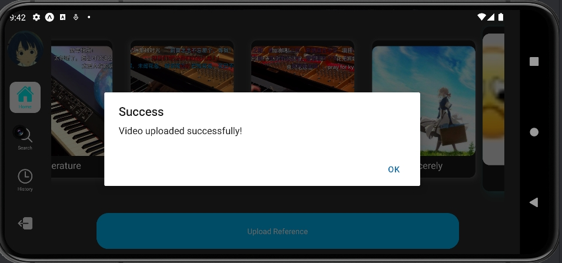

## It's MYGO!!!

### How to run
- Run server
```shell
    cd backend && docker compose up -d --build
```
- Remove images
```shell
    cd backend && docker compose down --rmi all
```

```shell
    cd web && npm start
```

```shell
    cd backend/app/usercenter/api && go run usercenter.go
```

```shell
    cd backend/app/media/api && go run media.go
```

```shell
    cd backend/app/audioanalysis && source .venv/bin/activate && python3 consumer.py
```


### How to use

---

#### Section 1: Welcome Screen


The password must include uppercase and lowercase letters, special characters, and be longer than 8 characters.


You should wait for verification code from your email and input it.

PS: If you accidentally exit while verifying your email, please log in with the email you registered and continue verifying your email.


---

#### Section 2: Sub-User Screen


If you haven't created a sub-user for your account on the web, please click the plus sign to create your first sub-user.

PS:The PIN must be a four-digit number.


Double-click the icon to enter the sub-user.


After entering the sub-user for the first time, you will need to fill out the configuration information.

PS: Can be modified in user screen.





